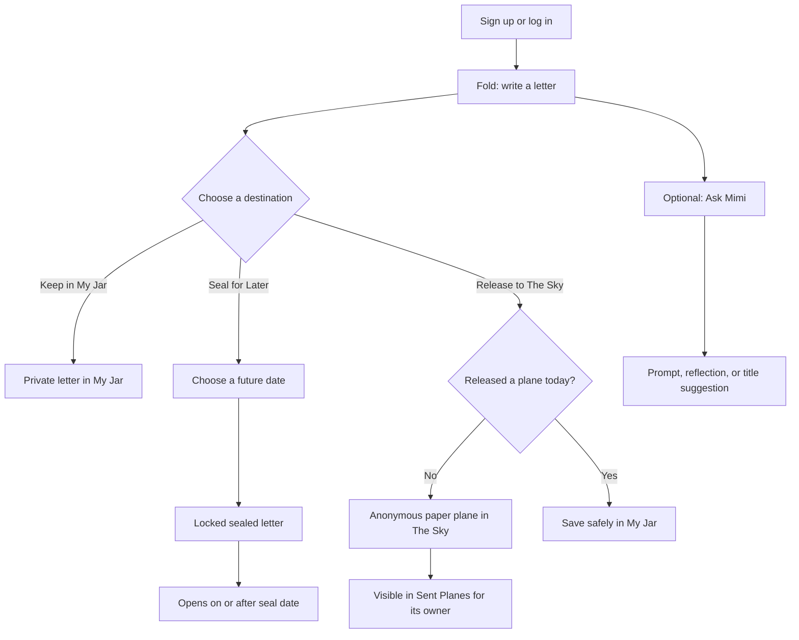
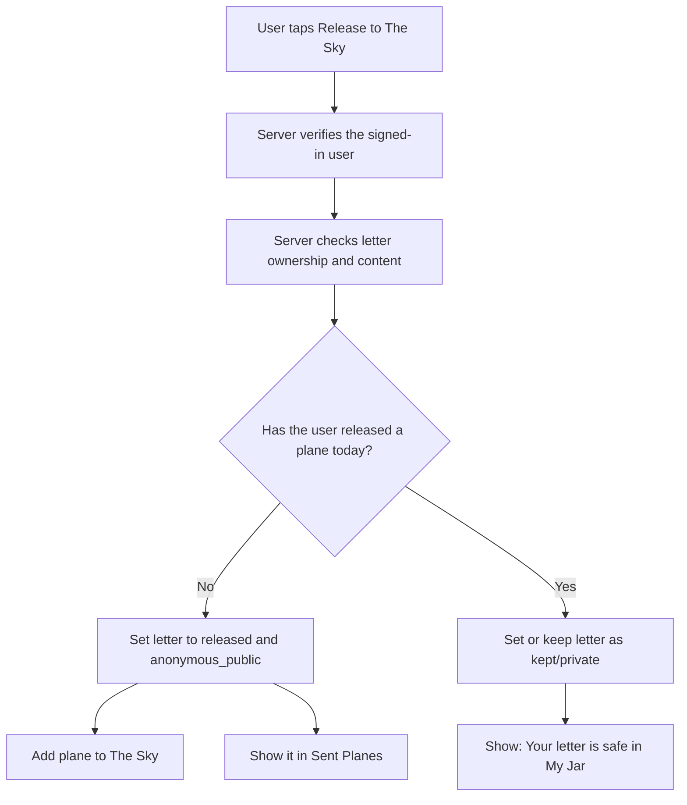

# Windup — Product Requirements Document

## 1. Product summary

Windup is a quiet, letter-based journaling web app. A person writes a letter, then chooses its destination:

- **Keep in My Jar** — save it privately.
- **Seal for Later** — lock it until a chosen future date.
- **Release to The Sky** — publish it anonymously as a paper plane for others to read.

Windup is intentionally smaller and slower than typical social media. Writing is unlimited, but a person may release only one public paper plane per calendar day. Mimi, the optional AI companion, helps a user start writing or reflect on a draft only after the user asks.

## 2. Problem and opportunity

Many people have thoughts they want to write down without turning them into polished blog posts or permanent social-media updates. Some thoughts are only for the writer; some are meant for their future self; some feel easier to share without an identity attached.

Windup gives these thoughts three clear homes. The paper-plane metaphor makes the public action feel intentional instead of impulsive.

## 3. Target user

The first version is for people who enjoy journaling, write private notes, or want an anonymous and gentle way to share thoughts. They may be students, young adults, or anyone who wants a less noisy writing space.

The MVP does not target organizations, teams, paid creators, or a large social network.

## 4. Product goals

- Make it easy to write and save a private letter.
- Make future letters feel meaningful through sealing and later opening.
- Let people share anonymously without exposing email addresses or profiles.
- Keep usage within beginner-friendly and free-tier-friendly limits.
- Add a small, useful AI touch without making AI the whole product.

## 5. Non-goals for the MVP

- Direct messages, follows, comments, or a friend system.
- Reactions, likes, notifications, or real-time feeds.
- End-to-end encryption.
- Automatic email delivery of the full letter.
- AI memory across every letter.
- Advanced ML training or a Python service.

## 6. Core experience

```text
Sign up with email
      ↓
Open Fold
      ↓
Write a letter and optionally select a mood
      ↓
Keep privately / Seal / Release anonymously
      ↓
Read and manage it in the matching space
```

### User journey diagram



## 7. Information architecture

| Area | Purpose | Who can see it |
| --- | --- | --- |
| Fold | Create or edit a letter | Owner only |
| My Jar | Private library of drafts, kept, sealed, and opened letters | Owner only |
| The Sky | Anonymous public letters shown as paper planes | Signed-in readers |
| Sent Planes | Owner’s record of their released public letters | Owner only |
| Settings | Account, privacy, and Mimi settings | Owner only |

## 8. MVP requirements

### 8.1 Account and authentication

- A visitor can sign up and log in with email and password through Supabase Auth.
- A signed-out visitor cannot read The Sky or access letters in the MVP.
- The app creates a `profiles` row for a new user.
- The app never displays a user’s email address in The Sky.

### 8.2 Letter editor: Fold

- A signed-in user can create a letter with optional title, required body, and optional mood.
- Suggested moods: calm, happy, sad, anxious, angry, hopeful, tired, confused, grateful, and other.
- A user can save a letter as a draft while writing.
- A user can choose one destination: keep, seal, or release.
- The interface must clearly explain what each action does before saving.
- Mimi actions are optional and do not happen automatically.

### 8.3 My Jar

- My Jar lists only the signed-in user’s private letters.
- Filters: All, Drafts, Kept, Sealed, and Opened.
- Cards show a title or safe body preview, mood, state, and creation date.
- A sealed letter does not reveal its body until its `seal_until` date has passed.
- A user can open, edit, or delete a draft or kept letter.

### 8.4 Seal for Later

- The user selects a future date before sealing a letter.
- The letter is private and locked before that date.
- Once the date arrives, the letter moves to an opened state when the user accesses it.
- MVP reminder: show the opened letter in My Jar. Email reminders are a later feature.

### 8.5 The Sky

- The Sky displays anonymous public letters only.
- The author appears as a neutral label such as “A passing plane,” never with account details.
- Initial load returns at most 10 letters.
- “Catch More” retrieves the next batch using cursor pagination.
- Readers can open a public letter’s full text.
- Public reading does not make an AI request.
- MVP has no comments or reactions.

### 8.6 Release to The Sky

- A user may release one letter each calendar day, calculated in a defined app timezone (start with UTC for simplicity, then document it in the UI if changed).
- Before release, the server must enforce the daily limit. Client-side checks alone are not enough.
- A released letter is anonymous to other users but remains associated with its owner in the database.
- If the limit is reached, save the letter as `kept` in My Jar and show when release becomes available again.
- The user can unpublish a released letter from Sent Planes. It stops appearing in The Sky and remains in My Jar as `unpublished`.

### Public release decision flow



### 8.7 Sent Planes

- Shows only the signed-in user’s released and unpublished letters.
- The owner can view, unpublish, and move an unpublished letter back to `kept`.
- The owner should be reminded that public readers cannot see their identity.

### 8.8 Mimi

- Mimi provides: starting prompt, gentle reflection, and title suggestion.
- Every request counts as one AI action.
- Each user has a maximum of three AI actions per calendar day.
- Before sending text, the interface says that the selected draft will be sent to Mimi through the AI provider.
- Mimi output is a suggestion, not a diagnosis or professional advice.

## 9. Acceptance criteria

The MVP is ready for a first private beta when:

1. A user can sign up, write, and save a private letter.
2. A private letter cannot be read by another authenticated user.
3. A sealed letter cannot be opened before its date.
4. A user can release one anonymous letter, and it appears in The Sky.
5. A second release on the same day is rejected by the server and preserved in My Jar.
6. The Sky loads only a small page of letters at once.
7. A user can unpublish their own public letter.
8. Mimi is limited to three server-verified requests per day.
9. Secret keys are never sent to the browser.

## 10. Privacy and safety requirements

- Apply Supabase Row Level Security to every table holding user content.
- Do not return `user_id`, email, or profile data in public-letter responses.
- Never send a draft to Groq without an explicit Mimi action.
- Limit request body size and validate input before storing or forwarding it.
- Provide a report action for public letters, even if moderation is manually reviewed in the MVP.
- Explain plainly that normal database storage is not end-to-end encryption.

## 11. Success signals for the first version

- A new user can create their first letter without help.
- Private letters save reliably.
- Released letters stay anonymous in public responses.
- Free-tier usage remains predictable because release, pagination, and AI-action limits work.

## 12. Future scope

- Email reminder with a link when a sealed letter opens.
- Soft reactions and public-letter reporting workflow.
- Search by mood or themes.
- Export personal letters as PDF.
- Monthly reflection based on user-selected letters.
- Optional encrypted private vault.
