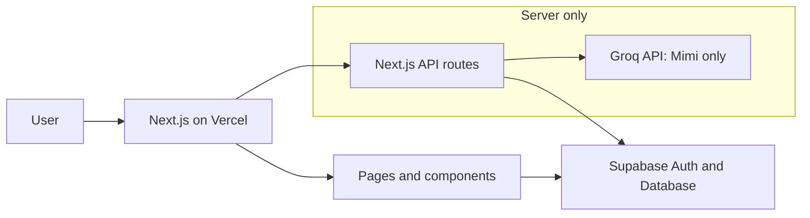
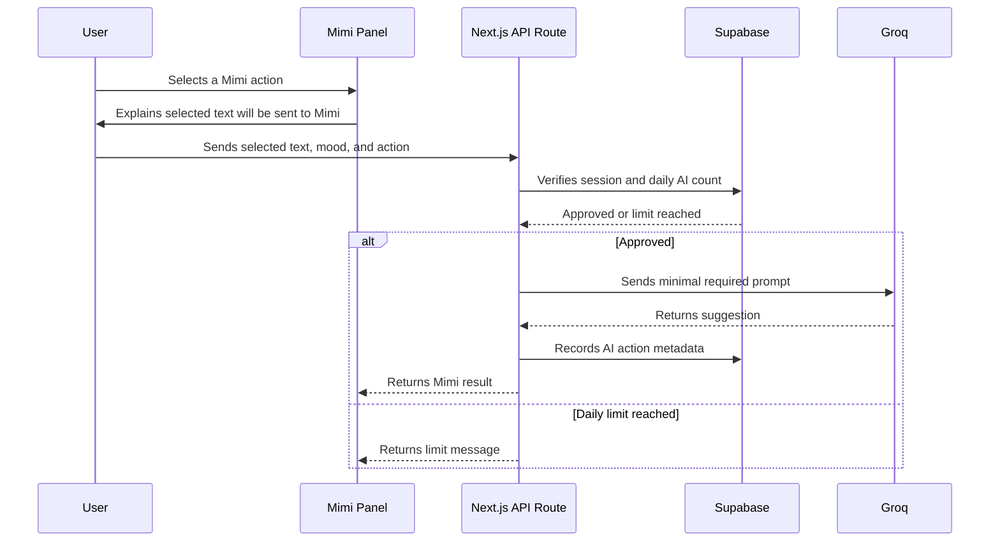

# Windup — Architecture

## 1. Overview

Windup uses a simple full-stack Next.js architecture. The browser renders the pages; Next.js server route handlers validate sensitive actions; Supabase handles authentication and data; Groq handles only optional Mimi requests; Vercel hosts the app.

```text
Browser
  ├─ Next.js pages and components
  ├─ Supabase Auth and safe database reads
  └─ Next.js API routes
          ├─ Supabase (sensitive writes and checks)
          └─ Groq (Mimi only)
```

The browser must never receive `GROQ_API_KEY` or `SUPABASE_SERVICE_ROLE_KEY`.

### System diagram



## 2. Chosen stack

| Need | Tool | Why it fits the MVP |
| --- | --- | --- |
| Web app | Next.js App Router | One project for pages and server routes |
| Language | TypeScript | Catches common mistakes early |
| Styling | Tailwind CSS | Fast, consistent UI building |
| Authentication | Supabase Auth | Email sign-up and session handling included |
| Database | Supabase Postgres | Relational data plus Row Level Security |
| AI companion | Groq API | Simple server-side chat completion calls |
| Hosting | Vercel | Direct deployment for Next.js |
| Editor | VS Code | Beginner-friendly and widely documented |

## 3. App Router layout

Route groups organize source files without changing the public URL.

```text
app/
  (auth)/                 # /login and /signup
  (dashboard)/            # signed-in app pages
  api/                    # server-only route handlers
  layout.tsx              # global HTML layout
  page.tsx                # landing page at /
```

The dashboard layout checks for a valid session. If none exists, it redirects to `/login`.

## 4. Ownership of responsibilities

| Layer | Responsibility |
| --- | --- |
| Page components | Display a screen and collect user input |
| Reusable components | Editor controls, cards, mood selection, Mimi panel |
| Route handlers | Validate input, verify user, enforce limits, call providers |
| `lib/` | Supabase clients, Groq client, prompt templates, utility functions |
| Supabase | Sessions, database storage, RLS enforcement |
| Groq | Generate Mimi text only after an authorized request |

## 5. Main flows

### Save a private letter

```text
Fold page → validate form → insert/update letters row → My Jar
```

For basic private saves, the browser can use the authenticated Supabase client because RLS prevents writing to another user’s rows. A server action or route handler is also acceptable if the project prefers one write path.

### Release a plane

```text
Fold page → POST /api/letters/release
  → authenticate user
  → validate body and letter ownership
  → count releases today
  → update letter when allowed
  → return result to Fold page
```

Release happens through a server route because the daily limit must be trustworthy. The route uses the signed-in user’s session and an atomic database function or transaction-style RPC to avoid two tabs bypassing the rule.

### Read The Sky

```text
The Sky page → query public view with cursor → receive 10 anonymous letter records
```

Use a deliberately limited public database view or RPC that exposes only safe fields. Do not query `letters` directly for all columns from a public screen.

### Ask Mimi

```text
Mimi panel → POST /api/ai/prompt or /api/ai/reflect
  → authenticate user
  → validate and size-limit selected text
  → count AI actions today
  → call Groq server-side
  → record usage
  → return suggestion
```

### Mimi request flow



## 6. Data and security boundaries

### Browser-safe values

- `NEXT_PUBLIC_SUPABASE_URL`
- `NEXT_PUBLIC_SUPABASE_ANON_KEY`
- Public letter fields already filtered by a view/RPC

### Server-only values

- `GROQ_API_KEY`
- `SUPABASE_SERVICE_ROLE_KEY`

The service role bypasses RLS, so use it only inside a protected server route when it is truly necessary. Prefer the user session client where possible. Never import server-only files into client components.

## 7. Authentication approach

1. The user signs up through Supabase Auth.
2. A database trigger creates a matching `profiles` row.
3. Middleware refreshes the session where needed.
4. The dashboard layout requires a user.
5. RLS uses `auth.uid()` to restrict letter ownership.

Email confirmation can be enabled in Supabase for the deployed version. During local development, it may be disabled temporarily for easier testing.

## 8. Performance and free-tier protection

- Fetch letter lists in pages of 10, not all at once.
- Select only required columns for cards.
- Add indexes for public feed order, owner library order, and daily limits.
- Use a server-side daily limit for public releases and Mimi actions.
- Keep Mimi stateless in the MVP: only the current text, mood, and selected action are sent.
- Do not generate AI content while users scroll, save, or read.

## 9. Error handling

Route handlers should return a clear status and safe message:

| Situation | Status | User-facing message |
| --- | --- | --- |
| No session | 401 | Please sign in to continue. |
| Invalid input | 400 | Please check the letter details and try again. |
| Not owner | 403 | You do not have access to this letter. |
| Daily limit reached | 429 | Your next plane can be released tomorrow. Your letter is safe in My Jar. |
| Groq unavailable | 503 | Mimi is taking a short pause. Please try again later. |

Do not send stack traces, database messages, secret values, or provider errors to the user interface.

## 10. Deployment

```text
GitHub repository → Vercel project → environment variables → deployment URL
                               ↘ Supabase project
                               ↘ Groq API
```

Add all server-only variables in Vercel’s environment settings. Add the Vercel URL to Supabase Auth redirect URLs. The Vercel-provided URL is enough for the MVP; a custom domain is optional.

## 11. Later architecture additions

- Vercel Cron or Supabase scheduled job for sealed-letter email reminders.
- Supabase Edge Function if reminder logic outgrows a Next.js route.
- A moderation queue for reports.
- An encrypted vault designed separately from normal letters.
