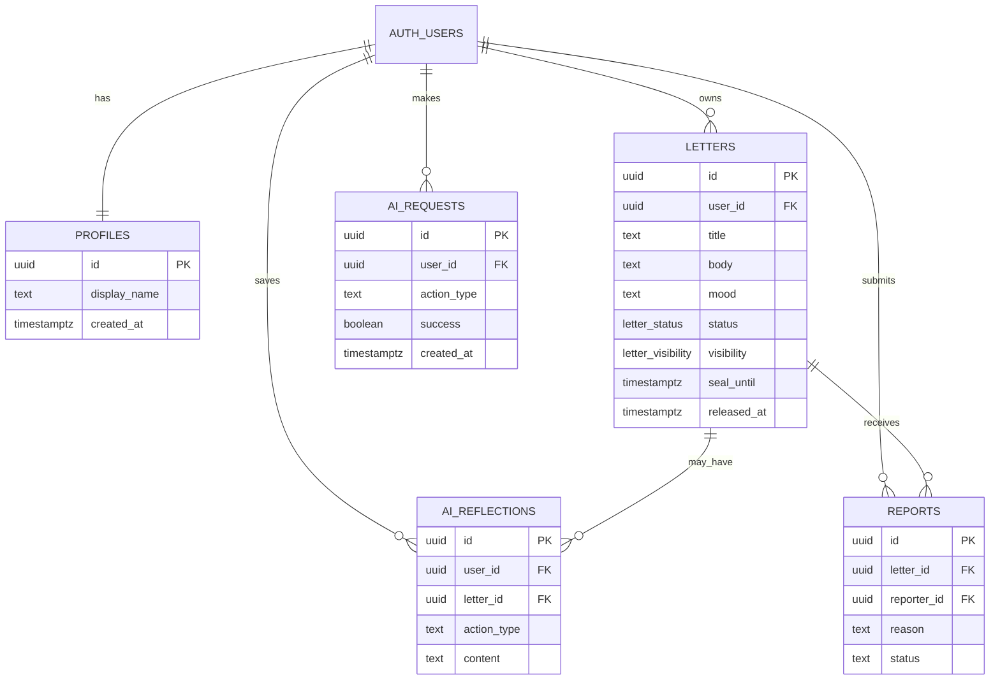
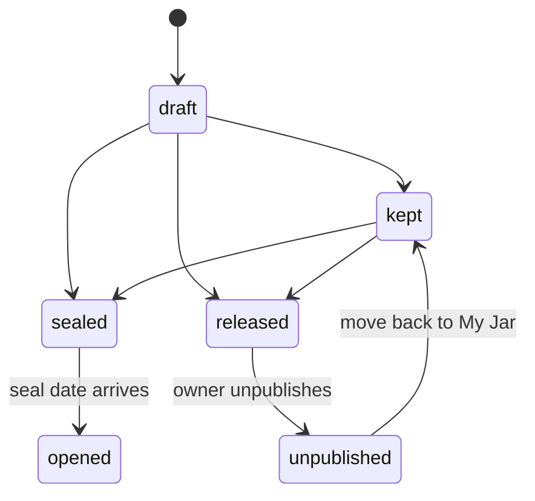

# Windup — Database Schema and Security Rules

## 1. Principles

- Every private letter belongs to exactly one authenticated user.
- A public letter is anonymous to readers but still owned internally.
- The client must not be trusted to enforce daily limits or ownership.
- RLS protects normal user access. Server routes handle cross-checks and sensitive workflows.

## 2. Enums

```sql
create type public.letter_status as enum (
  'draft',
  'kept',
  'sealed',
  'opened',
  'released',
  'unpublished'
);

create type public.letter_visibility as enum (
  'private',
  'sealed',
  'anonymous_public'
);
```

## 3. Tables

### `profiles`

Created automatically after a Supabase Auth user is created.

| Column | Type | Notes |
| --- | --- | --- |
| `id` | `uuid` | Primary key; references `auth.users.id` |
| `display_name` | `text` | Optional; never shown for anonymous public letters |
| `created_at` | `timestamptz` | Defaults to now |
| `updated_at` | `timestamptz` | Updated on edit |

### `letters`

The main table for drafts, private letters, sealed letters, and public planes.

| Column | Type | Notes |
| --- | --- | --- |
| `id` | `uuid` | Primary key |
| `user_id` | `uuid` | Owner; references `auth.users.id` |
| `title` | `text` | Optional; limit to 120 characters |
| `body` | `text` | Required for kept, sealed, and released letters; max 10,000 characters for MVP |
| `mood` | `text` | Optional controlled value |
| `status` | `letter_status` | Current life-cycle state |
| `visibility` | `letter_visibility` | Private, sealed, or anonymous public |
| `seal_until` | `timestamptz` | Required only while sealed |
| `released_at` | `timestamptz` | Set when released |
| `unpublished_at` | `timestamptz` | Set when removed from The Sky |
| `created_at` | `timestamptz` | Defaults to now |
| `updated_at` | `timestamptz` | Defaults to now |

Recommended checks:

```sql
check (char_length(title) <= 120),
check (char_length(body) <= 10000),
check (
  (status = 'sealed' and visibility = 'sealed' and seal_until is not null)
  or status <> 'sealed'
),
check (
  (status = 'released' and visibility = 'anonymous_public' and released_at is not null)
  or status <> 'released'
)
```

### `ai_reflections`

Only save a result when the user deliberately chooses to keep it.

| Column | Type | Notes |
| --- | --- | --- |
| `id` | `uuid` | Primary key |
| `user_id` | `uuid` | Owner |
| `letter_id` | `uuid` | Optional linked letter |
| `action_type` | `text` | `prompt`, `reflection`, or `title` |
| `content` | `text` | Mimi’s returned suggestion |
| `created_at` | `timestamptz` | Defaults to now |

Do not store the exact prompt or entire draft in this table by default.

### `ai_requests`

Tracks usage for the daily Mimi limit. It stores metadata, not the letter body.

| Column | Type | Notes |
| --- | --- | --- |
| `id` | `uuid` | Primary key |
| `user_id` | `uuid` | User who requested Mimi |
| `action_type` | `text` | `prompt`, `reflection`, or `title` |
| `created_at` | `timestamptz` | Used for daily count |
| `success` | `boolean` | Useful for debugging failed provider calls |

### `reports`

Allows signed-in users to flag a public letter for later manual review.

| Column | Type | Notes |
| --- | --- | --- |
| `id` | `uuid` | Primary key |
| `letter_id` | `uuid` | Reported letter |
| `reporter_id` | `uuid` | Person who submitted it |
| `reason` | `text` | Controlled reasons such as spam, harassment, or unsafe content |
| `details` | `text` | Optional note; maximum 500 characters |
| `status` | `text` | `open`, `reviewed`, or `resolved` |
| `created_at` | `timestamptz` | Defaults to now |

## 4. Relationships

```text
auth.users 1 ── 1 profiles
auth.users 1 ── * letters
auth.users 1 ── * ai_requests
auth.users 1 ── * ai_reflections
letters    1 ── * reports
```

### Entity relationship diagram



## 5. Indexes

```sql
create index letters_owner_updated_idx
  on public.letters (user_id, updated_at desc);

create index letters_public_feed_idx
  on public.letters (released_at desc, id desc)
  where status = 'released' and visibility = 'anonymous_public';

create index letters_release_limit_idx
  on public.letters (user_id, released_at desc)
  where status = 'released';

create index ai_requests_daily_limit_idx
  on public.ai_requests (user_id, created_at desc);
```

## 6. Row Level Security

Enable RLS on every application table.

```sql
alter table public.profiles enable row level security;
alter table public.letters enable row level security;
alter table public.ai_reflections enable row level security;
alter table public.ai_requests enable row level security;
alter table public.reports enable row level security;
```

### Private ownership policies

The user may read, create, edit, and delete only their own profile, letters, saved Mimi results, and request records.

```sql
create policy "users manage own letters"
on public.letters
for all
to authenticated
using (user_id = auth.uid())
with check (user_id = auth.uid());
```

For `profiles`, `ai_reflections`, and `ai_requests`, use the same ownership pattern with their respective owner column.

### Public feed must use a safe view or function

Do not add an unrestricted SELECT policy to `letters`, because it could expose `user_id` and sealed/private data. Instead, use a security-definer function that returns safe fields only:

```sql
create or replace function public.get_sky_letters(
  cursor_released_at timestamptz default null,
  cursor_id uuid default null,
  page_size integer default 10
)
returns table (
  id uuid,
  title text,
  body text,
  mood text,
  released_at timestamptz
)
language sql
security definer
set search_path = public
as $$
  select l.id, l.title, l.body, l.mood, l.released_at
  from public.letters l
  where l.status = 'released'
    and l.visibility = 'anonymous_public'
    and (
      cursor_released_at is null
      or (l.released_at, l.id) < (cursor_released_at, cursor_id)
    )
  order by l.released_at desc, l.id desc
  limit least(greatest(page_size, 1), 10);
$$;
```

Grant execute only to authenticated users if The Sky requires sign-in:

```sql
revoke all on function public.get_sky_letters from public;
grant execute on function public.get_sky_letters to authenticated;
```

## 7. Server-enforced limits

Use database RPCs or a server-side transaction for these checks:

| Rule | Source of truth |
| --- | --- |
| One released letter per day | Count matching `letters.released_at` on server/database |
| Three Mimi actions per day | Count `ai_requests.created_at` on server/database |
| Owner can alter only their letter | RLS plus user ID check |
| Release must have text | Server validation plus database checks |

The most reliable design is an RPC such as `release_letter(letter_id)` that checks ownership and the daily count, then changes the letter in one database operation.

## 8. Letter state transitions

```text
draft → kept
draft → sealed → opened
draft → released → unpublished → kept
kept  → sealed → opened
kept  → released → unpublished → kept
```

A released letter is anonymous to others. An unpublished letter is no longer public and can safely remain in the owner’s jar.

### Letter life-cycle diagram


