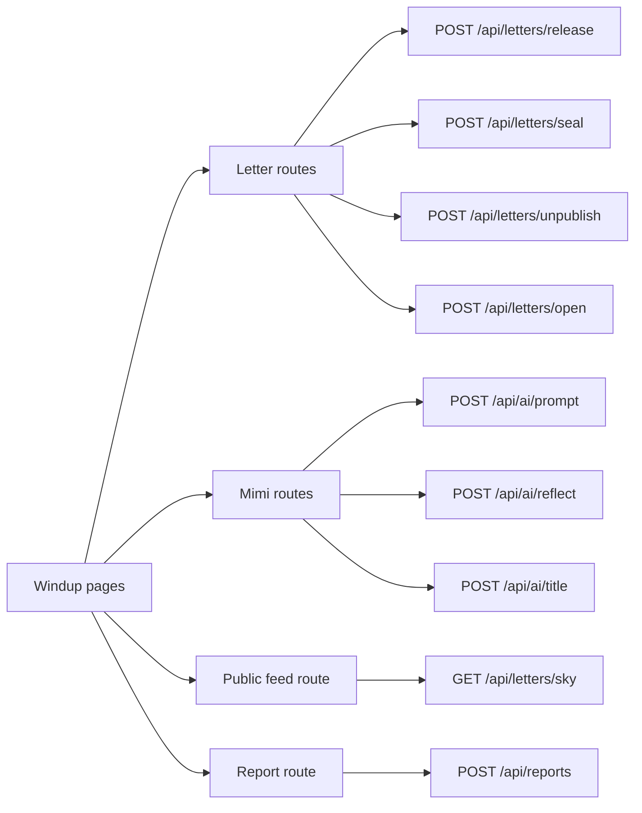

# Windup — API Routes

## 1. Purpose

These Next.js route handlers protect actions that the browser must not control by itself: public-release limits, Mimi limits, Groq requests, and sensitive ownership checks.

All routes return JSON. Every route should validate its input, get the current Supabase user from the server session, and avoid returning internal database fields.

## 2. Shared conventions

### Authentication

Every route below requires a signed-in user. Return:

```json
{ "error": "Please sign in to continue." }
```

with HTTP `401` when no session exists.

### Validation

Use Zod or a similar validation library. Recommended limits:

| Field | Rule |
| --- | --- |
| Letter title | Optional, 120 characters maximum |
| Letter body | 1–10,000 characters for save/release |
| Mood | One approved mood or `other` |
| Mimi text | 1–6,000 characters to reduce cost |
| Date | Valid future ISO date for seal action |
| Cursor | Valid ISO timestamp plus UUID |

### Response errors

| Status | Meaning |
| --- | --- |
| `400` | Invalid request data |
| `401` | User is signed out |
| `403` | User does not own the letter |
| `404` | Letter does not exist |
| `409` | Requested state transition is invalid |
| `429` | Public release or Mimi daily limit reached |
| `503` | Groq is temporarily unavailable |

### Route map



## 3. `POST /api/letters/release`

Releases an existing owned letter into The Sky.

### Request

```json
{ "letterId": "uuid" }
```

### Server work

1. Verify session.
2. Find the letter and confirm `user_id` matches the session user.
3. Confirm the letter has a non-empty body and is not sealed.
4. Count the user’s successful releases for today in UTC.
5. If there is already one, preserve or update the letter as `kept` and return `429`.
6. Otherwise set `status = released`, `visibility = anonymous_public`, and `released_at = now()`.
7. Return a safe owner response.

### Success response

```json
{
  "letter": {
    "id": "uuid",
    "status": "released",
    "releasedAt": "2026-09-20T10:00:00.000Z"
  }
}
```

### Limit response

```json
{
  "error": "Your next plane can be released tomorrow. This letter is safe in My Jar.",
  "code": "DAILY_RELEASE_LIMIT"
}
```

## 4. `POST /api/letters/seal`

Seals an owned letter until a future date.

### Request

```json
{ "letterId": "uuid", "sealUntil": "2026-10-20T00:00:00.000Z" }
```

### Server work

- Verify ownership.
- Require a future date and non-empty letter body.
- Set `status = sealed`, `visibility = sealed`, and `seal_until`.

### Success response

```json
{ "letter": { "id": "uuid", "status": "sealed", "sealUntil": "2026-10-20T00:00:00.000Z" } }
```

## 5. `POST /api/letters/unpublish`

Removes an owned paper plane from The Sky.

### Request

```json
{ "letterId": "uuid" }
```

### Server work

- Verify ownership and current status is `released`.
- Set `status = unpublished`, `visibility = private`, and `unpublished_at = now()`.
- Do not delete the letter body.

## 6. `POST /api/letters/open`

Opens an owned sealed letter only after its seal date.

### Request

```json
{ "letterId": "uuid" }
```

If `seal_until` is still in the future, return `409`. Otherwise set `status = opened`, `visibility = private`, and leave the original date for history.

## 7. `GET /api/letters/sky`

Returns the next safe batch for The Sky. This route may call `get_sky_letters` RPC, or the client may call that safe RPC directly. For a beginner MVP, choosing one path is enough; do not duplicate pagination logic.

### Query parameters

```text
cursorReleasedAt=ISO-date (optional)
cursorId=uuid (optional)
```

### Success response

```json
{
  "letters": [
    {
      "id": "uuid",
      "title": "A quiet thing I needed to say",
      "body": "...",
      "mood": "hopeful",
      "releasedAt": "2026-09-20T10:00:00.000Z"
    }
  ],
  "nextCursor": {
    "releasedAt": "2026-09-20T10:00:00.000Z",
    "id": "uuid"
  }
}
```

Do not include `userId`, email, display name, report history, or private state.

## 8. `POST /api/ai/prompt`

Generates a starting prompt through Mimi.

### Request

```json
{ "mood": "confused", "context": "I want to write about a friendship that changed." }
```

The context is optional and limited to 600 characters. Count the daily AI action before calling Groq. Record a successful or failed request without storing the whole context.

### Success response

```json
{
  "result": "What changed in the friendship, and what part of you is still waiting to be understood?",
  "remainingActionsToday": 2
}
```

## 9. `POST /api/ai/reflect`

Sends the user-selected current draft to Mimi for a gentle reflection.

### Request

```json
{ "text": "letter text", "mood": "sad" }
```

### Success response

```json
{
  "reflection": "Your letter seems to hold both grief and care.",
  "possibleTheme": "making space for an ending",
  "question": "What would feel lighter if you allowed yourself to say it plainly?",
  "remainingActionsToday": 1
}
```

The route must show no false certainty about the user’s mental health and must follow the Mimi prompt rules.

## 10. `POST /api/ai/title`

Suggests up to three optional titles for selected current text.

### Request

```json
{ "text": "letter text", "mood": "hopeful" }
```

### Success response

```json
{
  "titles": ["A small way forward", "What I am learning to carry", "Before tomorrow arrives"],
  "remainingActionsToday": 0
}
```

## 11. `POST /api/reports`

Creates a report for a released public letter.

### Request

```json
{ "letterId": "uuid", "reason": "harassment", "details": "optional explanation" }
```

The server verifies that the target is currently public, prevents duplicate reports by the same user for the same letter, and returns a simple confirmation. Do not expose reports to the reported author.

## 12. Future scheduled route

`POST /api/cron/sealed-reminders` is a later feature. It would be secured with a cron secret and run once daily to find letters whose seal date has passed. It should email only a reminder and link, never the full letter body.
