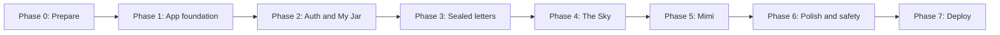

# Windup — Development Roadmap

## Current status

Windup is in the planning stage.

Completed:

- Product idea and brand direction
- README
- Product requirements document
- Architecture plan
- Database and API design
- Mimi AI behavior plan
- `.gitignore`

Not started yet:

- Next.js application code
- GitHub repository
- Supabase project
- Groq integration
- Deployment

## Guiding rule

Build one complete small flow at a time. Do not connect every tool on day one.

The first working version should let one user:

```text
Sign up → write a private letter → save it → find it in My Jar
```

Everything else comes after that works.

## Roadmap overview



## Phase 0 — Prepare the project

**Goal:** Create the working Next.js project and protect secret files.

### Tasks

- Initialize Next.js with TypeScript, Tailwind CSS, and App Router.
- Keep the existing `README.md`, `docs/`, and `.gitignore` files.
- Install and run the app locally.
- Open the project in VS Code.
- Create a private GitHub repository named `windup`.
- Initialize Git and make the first commit.

### Done when

- `npm run dev` opens a local Windup page.
- The project has `app/`, `components/`, `lib/`, `package.json`, and `node_modules/`.
- `.env.local` is ignored by Git.
- The code is backed up in a private GitHub repository.

### Do not build yet

- Supabase
- Groq
- AI
- Paper-plane animations

## Phase 1 — Build the visual foundation

**Goal:** See Windup as an app before connecting real data.

### Tasks

- Create the landing page.
- Create the dashboard layout and navigation.
- Add pages for Fold, My Jar, The Sky, Sent Planes, and Settings.
- Build reusable components:
  - `MoodPicker`
  - `LetterCard`
  - `PaperPlaneCard`
  - `PrivacySelector`
  - `MimiPanel`
- Use sample letters stored locally in code.
- Establish the visual direction: warm paper, soft sky, jars, and quiet typography.

### Done when

- Every main page can be opened from the navigation.
- The Fold page looks like a letter-writing experience.
- My Jar and The Sky show sample cards.
- No login, database, or AI is required yet.

## Phase 2 — Connect Supabase and build private letters

**Goal:** A real user can sign up and keep private letters.

### Tasks

- Create a Supabase project.
- Add Supabase URL and anonymous key to `.env.local`.
- Add sign-up, login, logout, and protected dashboard pages.
- Create `profiles` and `letters` tables.
- Turn on Row Level Security.
- Add policies so users can access only their own letters.
- Connect Fold to save a draft or keep a private letter.
- Connect My Jar to list, open, edit, and delete the owner’s letters.

### Done when

```text
User A cannot read User B’s private letter.
User A can write a private letter, refresh the page, and still find it in My Jar.
```

### Test before moving on

- Sign up with two different test accounts.
- Create a letter with Account A.
- Confirm Account B cannot access it, even by guessing a letter URL.

## Phase 3 — Add Seal for Later

**Goal:** A private letter can stay locked until a future date.

### Tasks

- Add `SealDatePicker`.
- Create the seal API route.
- Store `status`, `visibility`, and `seal_until` values.
- Hide the body of sealed letters before the opening date.
- Change an eligible sealed letter to `opened` when its owner opens it after the date.
- Add sealed and opened filters to My Jar.

### Done when

- A user cannot read a sealed letter before the selected date.
- The same letter becomes readable on or after the selected date.

### Later, not now

- Email reminders
- Automatic sending of the full letter by email

## Phase 4 — Add public paper planes and The Sky

**Goal:** Users can share one anonymous letter each day without overloading the app.

### Tasks

- Create the safe public-feed function or route from the database document.
- Build `POST /api/letters/release` with server-side ownership and daily-limit checks.
- Add the Release to The Sky action to Fold.
- Add The Sky feed with 10 letters per load and a Catch More button.
- Add Sent Planes so owners can view their own released letters.
- Add unpublish and move-back-to-My-Jar actions.
- Add basic report button and `reports` table.

### Done when

```text
One release succeeds.
A second release on the same day is saved privately instead of being deleted.
The public feed never exposes email, user ID, or private letters.
```

### Test before moving on

- Create two test accounts.
- Release a plane from Account A.
- Confirm Account B sees the letter but not Account A’s identity.
- Confirm Account A can unpublish it.

## Phase 5 — Add Mimi through Groq

**Goal:** Add a small, transparent AI touch to writing.

### Tasks

- Create a Groq API key and add it to `.env.local`.
- Create the server-only Groq client and Mimi prompts.
- Build Help me start, Reflect with Mimi, and Suggest a title actions.
- Create `ai_requests` table and enforce three actions per user per day.
- Add the privacy notice before the draft is sent to Mimi.
- Keep Mimi responses short and structured.
- Add graceful errors when Groq is unavailable.

### Done when

- Mimi does nothing until the user taps an AI action.
- The server limits each user to three AI actions per day.
- Mimi returns suggestions without changing the letter automatically.

## Phase 6 — Polish, safety, and testing

**Goal:** Make the MVP feel safe, clear, and ready for other people to try.

### Tasks

- Improve loading, empty, error, and success states.
- Make the design responsive on phone and desktop.
- Check keyboard navigation and readable color contrast.
- Add clear public/private labels before every save or release action.
- Review RLS policies and test with two accounts again.
- Test the daily public-release and Mimi limits.
- Add a basic manual process for reviewing public-letter reports.
- Write a short privacy page and terms placeholder.

### Done when

- The most important flows work on mobile and desktop.
- Errors do not lose the user’s draft.
- A tester can understand what is private, sealed, and public.

## Phase 7 — Deploy a private beta

**Goal:** Put Windup online for a small group of testers.

### Tasks

- Push the latest code to GitHub.
- Import the repository into Vercel.
- Add Supabase and Groq environment variables in Vercel.
- Add the Vercel URL to Supabase Auth redirect settings.
- Test sign-up, login, private saving, public release, and Mimi on the deployed URL.
- Invite a small number of trusted testers.

### Done when

- Windup works on a Vercel URL.
- No secret keys appear in the GitHub repository or browser code.
- A few testers can use the full core flow.

## What to postpone until after beta

- Custom domain
- Email reminders for sealed letters
- End-to-end encryption
- Likes, comments, and following
- Real-time updates
- Advanced paper-plane animations
- Monthly emotional summaries
- Payments or subscriptions
- Python/ML service

## Recommended first build session

Start with Phase 0, then complete only these small tasks:

1. Initialize Next.js.
2. Start the local app.
3. Replace the default home page with a simple Windup landing page.
4. Create empty page files for Fold, My Jar, The Sky, Sent Planes, and Settings.
5. Make the first Git commit.

At that point, Windup has a real foundation. The next session can focus entirely on its visual design.
